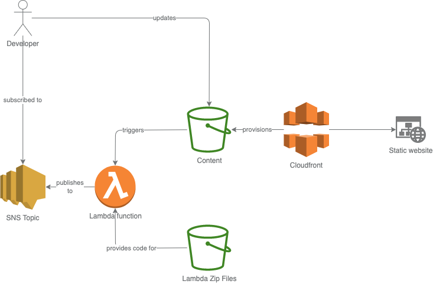

== Hosting a static website on AWS

This repository contains `terraform` code to host a static website serverlessly on AWS infrastructure.

[IMPORTANT]
.Best effort
====
The code is provided as a best-effort solution.
The author does not cover any AWS charges that may apply nor is the author liable for missing security features.
====

=== Overview 

From the website visitor's point of view the architecture is straightforward: the visitor goes to the website which is hosted via AWS Cloudfront.
Cloudfront provisions the website from an S3 bucket containing the content.

From the developer's point of view the architecture is a little more intricate.
Besides the S3 bucket for content hosting there is another S3 bucket to which `zip` files are deployed.
The `zip` files provide the self-contained for an AWS Lambda function.
The AWS Lambda function is triggered whenever there is new content being created or removed.
The Lambda function then publishes to an SNS topic to which the developer has subscribed.

=== Requirements

You need the following:

* AWS account for cloud resources,
* `terraform` for provisioning,
* `golang` for building the AWS Lambda function
* `make` for building

=== Provisioning

[source bash]
----
make build_lambda
make init
make apply
----

You will be prompted to enter an e-mail address (fyi: as your email is sensitive you will not see what you type).
This is the e-mail address to which notifications will be sent.
Note that you will have to confirm the subscription.

Once `terraform` has performed it's magic you should see the cloudfront website endpoint as an output variable, e.g.

[source, bash]
----
Outputs:

cloudfront_website_endpoint = "d1zr6h6nqh6mu.cloudfront.net"
----

Go ahead and paste the address to a browser.

Et voilà.

Let's verify next that the subscriptions are working.

Go to the AWS Console, navigate to S3 and select your `content` bucket.
Upload a file.
This should trigger a notification to your previously entered e-mail address.

=== Lambda function

Whenever you modify the source code of the AWS Lambda function, you need to run `make build_lambda` before `make apply`.

The command `make build_lambda` builds the binary and packages it to a `zip` file.
Also, the command manually computes a hash.
This hash is used in the `terraform` code to set the `hash_source` of the AWS Lambda.
Usually, you'd use `terraform` built-in functions, but as long as https://github.com/hashicorp/terraform-provider-aws/issues/7385[this issue] remains open, this is an effective workaround to avoid constant re-deployment of the AWS Lambda function by `terraform`.

